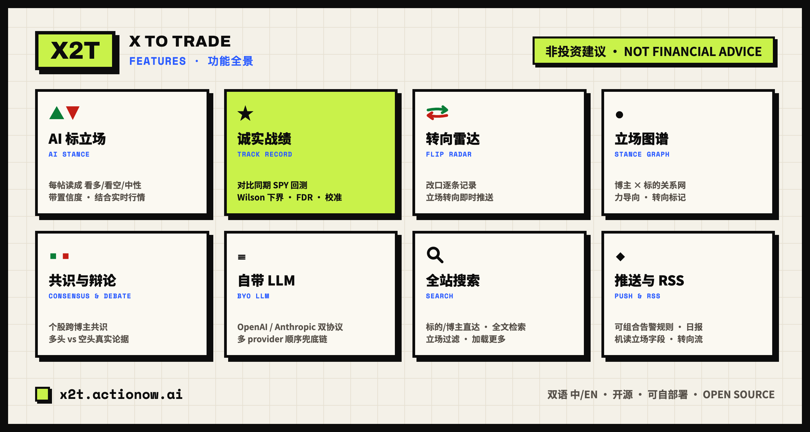
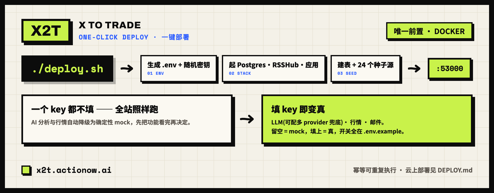

<div align="center">


<h1>X2T · X to Trade</h1>

**Track what the financial influencers you follow are actually saying — every post read into a bullish / bearish call on specific tickers by AI, scored against their real track record, in Chinese and English.**

[](LICENSE)
[](#one-click-deploy)
[](https://x2t.actionow.ai)

[**Live demo**](https://x2t.actionow.ai) · [English](README.md) · [简体中文](README.zh-CN.md) · [Deploy](DEPLOY.md)

</div>

---

## Overview

X2T watches the financial influencers you follow on X (Twitter), Reddit and news feeds, and reads every post — with AI, grounded in live market data — into a bullish / bearish / neutral call per ticker. Calls aggregate into per-stock consensus, bull-vs-bear debates and a stance graph; stance flips push to you instantly; and every call is settled against the market, so each influencer carries an honest, statistics-grade track record. Open source, built to self-host.

> [!IMPORTANT]
> **Not financial advice.** X2T aggregates public posts and public market data for reference only. Nothing here is a recommendation to buy or sell anything.

**Try it live:** [x2t.actionow.ai](https://x2t.actionow.ai) — ~24 curated US-stock sources, bilingual, nothing to install.

## Features

<div align="center">

</div>

<details>
<summary><b>Full feature breakdown</b></summary>

| | |
| --- | --- |
| **Multi-source ingestion** | Self-hosted RSSHub gateway (X / Reddit), direct RSS (news / Substack), or manual submission. ~24 curated US-stock sources out of the box. Idempotent dedup on `(influencer, platformPostId)`. |
| **Grounded AI analysis** | An LLM agent reads each post in its original language, extracts tickers (cashtags + company / product / A-share names), pulls live data per ticker, and judges agree-vs-diverge against price, news and sentiment — with **calibrated confidence**: emotional hype, sarcasm, penny-stock pumping and forwarded news are deliberately *not* read as high-confidence calls. Settled results feed back into the prompt (**belief loop**), so the agent knows each influencer's real track record when reading their next post. |
| **Bring your own LLM** | Any OpenAI- or Anthropic-compatible endpoint (DeepSeek, GPT, Claude, Gemini, aggregator relays). Configure a **multi-provider fallback chain** — numbered endpoints, each with its own base URL / key / model / wire format — that degrades in order on error, timeout, 429 / 5xx or empty output. Translation uses a cheaper model, decoupled per endpoint. |
| **Track record — the moat** | Each directional call is back-tested against the **same-window SPY** over 5 trading days. Per influencer: a **"beat the market" rate** with a **Wilson 95 % confidence interval** and a minimum-sample gate (no misleading "50 % off 20 calls"). A **leaderboard** ranks everyone with **Benjamini–Hochberg FDR** correction so the top isn't just luck, plus an **"if you followed" equity curve** and a **calibration panel** — recency-weighted beat rate, Brier score, dual 5-day / 20-day horizons. |
| **Stance over time** | Per-influencer stance ledger (latest stance per ticker + flip markers), stance-flip detection, and a *recent flips* board on the home dashboard. Every ticker page overlays **net stance vs price**, so you see the calls against what the chart actually did. |
| **Consensus & debate** | Per-ticker consensus across influencers (one vote each, latest stance, small samples flagged), a **Bull vs Bear debate view** (long case / short case / where they split) derived from real rationales, and a force-directed influencer↔ticker **stance graph** (d3-force, recency-weighted edges, flip markers, zoom, fullscreen, screen-reader text). News-relay accounts are labeled so "consensus" isn't diluted by headlines. |
| **Search & paging** | Full-site search: ticker / influencer quick-jump, full-text across originals and both translations, stance filter. Cursor-based *load more* on the feed, influencer pages and search results. |
| **Alerts & digests** | Composable **alert rules** (e.g. *≥N bulls AND a flip on $X → notify me*), per-influencer flip push, and an opt-in **daily email digest** led by stance flips. Notification governance: per-(post×sub) dedup, cooldown, daily cap, quiet hours. |
| **Structured RSS** | Every feed carries machine-readable `x2t:stance / confidence / divergence / ticker`; a dedicated **`/rss/flips`** event stream with `x2t:flip`; composable `?sig=1` / `?conf=0.7` filters for quant/dashboard pipelines. |
| **Social** | Like / dislike with counts (anonymous-friendly), one-click **share cards** (client-side `<canvas>`), post-to-X, and server-rendered **dynamic OG images** in the site's paper-brand style for every post / influencer / ticker page — ticker cards embed a net-stance-vs-price mini chart. |
| **Accounts** | Passwordless **email verification-code** login (6-digit OTP, no link). Follows sync to the cloud when logged in, live in the browser when anonymous; the feed defaults to signal-first to suppress neutral-news noise. |
| **Bilingual, responsive UI** | Cookie-based zh / en, three-version post views (original / 中文 / English), a deliberate neo-brutalist *Tape* design system, PC multi-column / mobile single-column with a drawer nav. |
| **Production-hardened** | Redis-optional rate limiting, fail-closed admin & secrets, HMAC sessions with revocation, SSRF-guarded image proxy & price fetch, CSP, composite indexes + bounded cached queries, a self-healing worker, full SEO (metadata, sitemap, robots, JSON-LD, OpenGraph) and analytics. |

</details>

## How it works

<div align="center">

</div>

One container runs both the web app and a background worker: pull new posts every few minutes, label them with AI, push flips instantly, settle calls against the same-window SPY — scored with proper statistics (Wilson interval, FDR correction), not raw win rates.

## One-click deploy

```bash
# after cloning this repo — Docker is the only prerequisite
./deploy.sh
```

<div align="center">

</div>

Every switch is documented in [`.env.example`](.env.example); a step-by-step cloud guide ([Zeabur](https://zeabur.com)) is in **[DEPLOY.md](DEPLOY.md)**.

> **Need a server?** Buy one on [**Zeabur**](https://zeabur.com) and enter referral code **`actionow.ai`** at checkout for 10% off.

## Contributing

Issues and pull requests are welcome — open an issue first for larger changes. Local dev: `docker compose up -d db rsshub && pnpm install && pnpm db:push && pnpm db:seed && pnpm dev`, then `npx tsc --noEmit` and `pnpm test` before submitting.

## License

[MIT](LICENSE) © actionow.ai

<div align="center">
<sub>Open source · Self-hostable · Not financial advice</sub>
</div>
