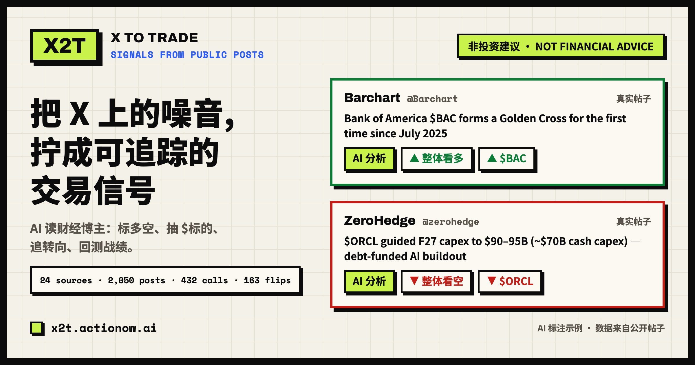
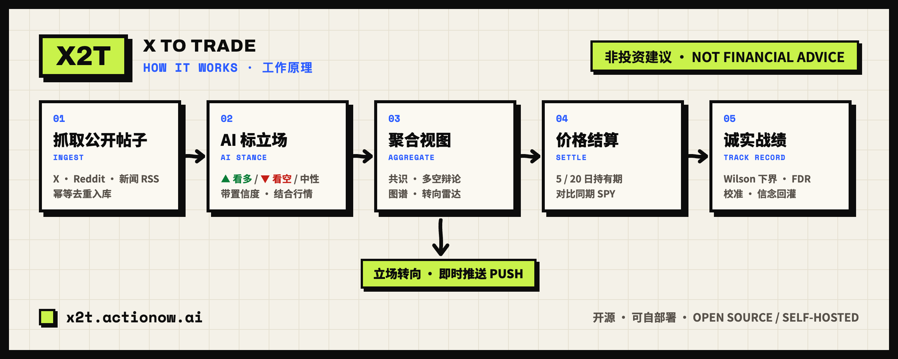

<div align="center">



<h1>X2T · X to Trade</h1>

**Track what the financial influencers you follow are actually saying — every post read into a bullish / bearish call on specific tickers by AI, scored against their real track record, in Chinese and English.**

[](LICENSE)
[](#configuration)
[](https://x2t.actionow.ai)

[**Live demo**](https://x2t.actionow.ai) · [English](README.md) · [简体中文](README.zh-CN.md) · [Deploy](DEPLOY.md)

</div>

---

## Overview

X2T watches the financial influencers you follow on X (Twitter), Reddit and news/Substack feeds. The moment one of them posts, X2T fetches it, runs an AI agent that grounds the post against live market data, reads it into a bullish / bearish / neutral call per ticker, and writes a bilingual summary. It then aggregates those calls into per-stock **consensus**, a **bull-vs-bear debate**, an influencer↔ticker **stance graph**, and — the part nobody else does — an honest **track record**: did following each influencer actually beat the market? It pushes you an alert the moment someone flips their stance. Open source, built to self-host.

> [!IMPORTANT]
> **Not financial advice.** X2T aggregates public posts and public market data for reference only. Nothing here is a recommendation to buy or sell anything.

### Try it live — no setup

A public trial instance runs at **[x2t.actionow.ai](https://x2t.actionow.ai)** with ~24 curated US-stock sources. Browse the signal feed and AI analysis, open the leaderboard, search across everything, explore the stance graph and per-stock consensus + debate, switch between Chinese and English, follow influencers, react and share — all in the browser, nothing to install.

## Table of contents

- [Features](#features)
- [How it works](#how-it-works)
- [One-click deploy](#one-click-deploy)
- [Configuration](#configuration)
- [Contributing](#contributing)
- [License](#license)

## Features

| | |
| --- | --- |
| **Multi-source ingestion** | Self-hosted RSSHub gateway (X / Reddit), direct RSS (news / Substack), or manual submission. ~24 curated US-stock sources out of the box. Idempotent dedup on `(influencer, platformPostId)`. |
| **Grounded AI analysis** | An LLM agent reads each post in its original language, extracts tickers (cashtags + company / product / A-share names), pulls live data per ticker, and judges agree-vs-diverge against price, news and sentiment — with **calibrated confidence**: emotional hype, sarcasm, penny-stock pumping and forwarded news are deliberately *not* read as high-confidence calls. Settled results feed back into the prompt (**belief loop**), so the agent knows each influencer's real track record when reading their next post. |
| **Bring your own LLM** | Any OpenAI- or Anthropic-compatible endpoint (DeepSeek, GPT, Claude, Gemini, aggregator relays). Configure a **multi-provider fallback chain** — numbered endpoints, each with its own base URL / key / model / wire format — that degrades in order on error, timeout, 429 / 5xx or empty output. Translation uses a cheaper model, decoupled per endpoint. |
| **Track record — the moat** | Each directional call is back-tested against the **same-window SPY** over 5 trading days. Per influencer: a **"beat the market" rate** with a **Wilson 95 % confidence interval** and a minimum-sample gate (no misleading "50 % off 20 calls"). A **leaderboard** ranks everyone with **Benjamini–Hochberg FDR** correction so the top isn't just luck, plus an **"if you followed" equity curve** and a **calibration panel** — recency-weighted beat rate, Brier score, dual 5-day / 20-day horizons. |
| **Stance over time** | Per-influencer stance ledger (latest stance per ticker + flip markers), stance-flip detection, and a *recent flips* board on the home dashboard. Every ticker page overlays **net stance vs price**, so you see the calls against what the chart actually did. |
| **Consensus & debate** | Per-ticker consensus across influencers (one vote each, latest stance, small samples flagged), a **Bull vs Bear debate view** (long case / short case / where they split) derived from real rationales, and a force-directed influencer↔ticker **stance graph** (d3-force, recency-weighted edges, flip markers, zoom, fullscreen, screen-reader text). News-relay accounts are labeled so "consensus" isn't diluted by headlines. |
| **Search & paging** | Full-site search: ticker / influencer quick-jump, full-text across originals and both translations, stance filter. Cursor-based *load more* on the feed, influencer pages and search results. |
| **Alerts & digests** | Composable **alert rules** (e.g. *≥N bulls AND a flip on $X → notify me*), per-influencer flip push, and an opt-in **daily email digest** led by stance flips. Notification governance: per-(post×sub) dedup, cooldown, daily cap, quiet hours. |
| **Structured RSS** | Every feed carries machine-readable `x2t:stance / confidence / divergence / ticker`; a dedicated **`/rss/flips`** event stream with `x2t:flip`; composable `?sig=1` / `?conf=0.7` filters for quant/dashboard pipelines. |
| **Social** | Like / dislike with counts (anonymous-friendly), one-click **share cards** (client-side `<canvas>`), post-to-X, and server-rendered **dynamic OG images** in the site's paper-brand style for every post / influencer / ticker page — ticker cards embed a net-stance-vs-price mini chart. |
| **Accounts** | Passwordless **email verification-code** login (6-digit OTP, no link). Follows sync to the cloud when logged in, live in the browser when anonymous; the feed defaults to signal-first to suppress neutral-news noise. |
| **Bilingual, responsive UI** | Cookie-based zh / en, three-version post views (original / 中文 / English), a deliberate neo-brutalist *Tape* design system, PC multi-column / mobile single-column with a drawer nav. |
| **Production-hardened** | Redis-optional rate limiting, fail-closed admin & secrets, HMAC sessions with revocation, SSRF-guarded image proxy & price fetch, CSP, composite indexes + bounded cached queries, a self-healing worker, full SEO (metadata, sitemap, robots, JSON-LD, OpenGraph) and analytics. |

## How it works

<div align="center">

</div>

One container runs both the web app and a background worker. Every few minutes the worker pulls new posts, the AI labels each one against live market data, stance flips push out instantly, and settled calls feed the leaderboard and each influencer's calibration — scored with proper statistics (Wilson interval, FDR correction), not raw win rates.

## One-click deploy

Docker is the only prerequisite:

```bash
# after cloning this repo
./deploy.sh
```

The script generates `.env` with a random `AUTH_SECRET`, builds and starts the full stack (Postgres + RSSHub + the app, web and worker in one container), creates the schema and seeds ~24 curated US-stock sources. Then open **http://localhost:53000**.

It runs with **zero API keys** — AI analysis and market data degrade to deterministic mocks. Fill keys into `.env` (LLM, market data, email, …) and rerun `docker compose --profile full up -d` to go live.

Prefer a cloud host? A step-by-step [Zeabur](https://zeabur.com) guide is in **[DEPLOY.md](DEPLOY.md)**.

> **Need a server?** Buy one on [**Zeabur**](https://zeabur.com) and enter referral code **`actionow.ai`** at checkout for 10% off.

## Configuration

Every integration follows one rule: **leave the env var blank and it degrades to mock; fill it in and it goes live.** See [`.env.example`](.env.example) for the full, commented list — grouped into Postgres, app URL, Google Analytics, ingestion / polling, RSSHub, web-push (VAPID), LLM (multi-provider fallback chain, OpenAI & Anthropic wire formats), market data (Finnhub / Exa / Alpha Vantage), accounts + email, rate-limit Redis, daily digest / alert gates, and the admin allowlist. Notable optional knobs: numbered LLM fallback endpoints (`LLM_API_KEY_2`, `LLM_BASE_URL_2`, `LLM_MODEL_2`, `LLM_FORMAT_2=openai|anthropic`, …), `REDIS_URL` (cross-instance rate limiting), `WORKER_RUN_DIGEST` + an email provider (to actually send digests), `PUSH_COOLDOWN_MINUTES` / `QUIET_HOURS_UTC` (notification governance), `WINRATE_SHOW_SAMPLES` (track-record display threshold).

## Contributing

Issues and pull requests are welcome. For larger changes, open an issue first to discuss the direction. Local dev without Docker rebuilds: `docker compose up -d db rsshub && pnpm install && pnpm db:push && pnpm db:seed && pnpm dev` (web on :53000, worker via `pnpm worker`). Run `npx tsc --noEmit` and `pnpm test` before submitting; CI runs both on every push.

## License

[MIT](LICENSE) © actionow.ai

<div align="center">
<sub>Open source · Self-hostable · Not financial advice</sub>
</div>
